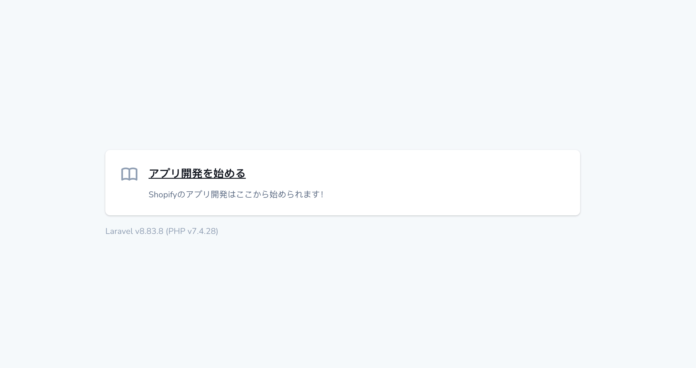

# Learn Shopify App

Shopifyアプリを学ぶ目的で作成したリポジトリです。ぼちぼち更新中

## Usage

1.envファイルをコピーする
```
コピー先で設定は自由に変えて頂いて構いません。
$ cp .env-sample .env
```

2. dockerを起動する
```
起動
$ docker-compose up -d
（初回はビルドが入るため、時間がかかります）

終了
$ docker-compose down
```

3. localhostにアクセスして、センターの「アプリ開発を始める」から読み進めてください！



## Settings
### ・PHP My Adminのインポートサイズを変更する
1. [upload.ini](./docker/phpmyadmin/upload.ini)を開く
2. 設定値を変更する
```
例

upload_max_filesize=128M
```

## Available by default

- PHP
- MySQL
- PHP My Admin
- MailHog